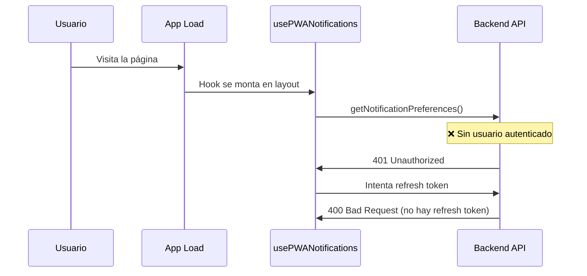
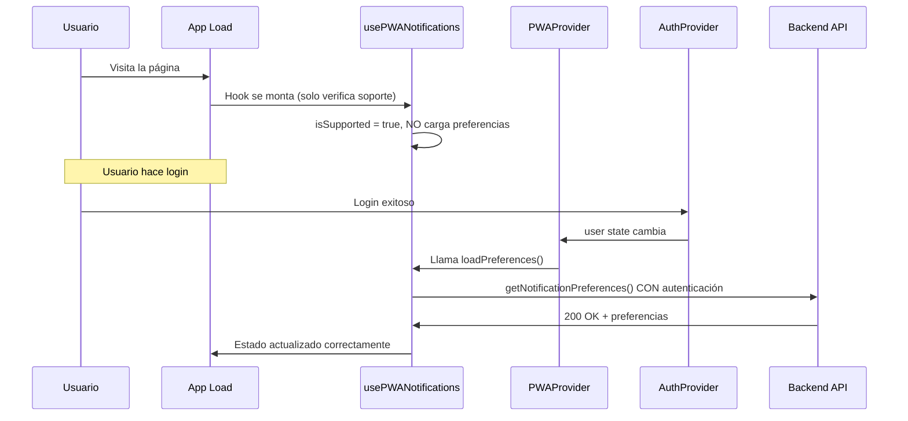

# Authentication Flow Fix - Notification Preferences Loading

## 📋 Resumen del Problema Real

El error **401 Unauthorized** en las preferencias de notificaciones se debía a un **problema de flujo de autenticación**, no de configuración de cookies. La aplicación intentaba obtener las preferencias de notificaciones **antes** de que el usuario se hubiera autenticado.

### Errores Observados:
```javascript
4759-88e378eff6a0d501.js:1 User is not authenticated
4759-88e378eff6a0d501.js:1 GET https://personalfitsantafe.com/api/notifications/pwa/preferences 401 (Unauthorized)
4759-88e378eff6a0d501.js:1 POST https://personalfitsantafe.com/api/auth/refresh 400 (Bad Request)
```

## 🔍 Análisis del Flujo Problemático

### Secuencia Original (Incorrecta):


### Ubicación del Problema:
- **Archivo**: `hooks/notifications/use-pwa-notifications.ts`
- **Función**: `useEffect` inicial que carga preferencias
- **Provider**: `PWANotificationProvider` en el `layout.tsx`
- **Momento**: Al cargar la aplicación, antes del login

## ✅ Solución Implementada

### 1. **Separación de Responsabilidades**

**Antes:**
```typescript
// Hook cargaba preferencias automáticamente al montarse
useEffect(() => {
  const checkSupport = async () => {
    // ...
    // ❌ PROBLEMA: Llamada automática sin verificar autenticación
    const preferences = await getNotificationPreferences();
    // ...
  };
  checkSupport();
}, []);
```

**Después:**
```typescript
// Hook solo verifica soporte de notificaciones
useEffect(() => {
  const checkSupport = async () => {
    if (typeof window !== 'undefined' && 'Notification' in window && 'serviceWorker' in navigator) {
      setState(prev => ({
        ...prev,
        isSupported: true,
        permission: Notification.permission,
        isLoading: false // ✅ Termina loading inmediatamente
      }));
    }
  };
  checkSupport();
}, []);

// ✅ Nueva función separada para cargar preferencias
const loadPreferences = useCallback(async () => {
  if (!state.isSupported) return;
  
  setState(prev => ({ ...prev, isLoading: true }));
  
  try {
    const preferences = await getNotificationPreferences();
    setState(prev => ({
      ...prev,
      preferences: preferences || defaultPreferences,
      isLoading: false
    }));
  } catch (error) {
    console.error('Error loading notification preferences:', error);
    setState(prev => ({ ...prev, isLoading: false }));
  }
}, [state.isSupported]);
```

### 2. **Control desde el Provider**

**Antes:**
```typescript
// Provider no controlaba cuándo cargar preferencias
export function PWANotificationProvider({ children }: PWANotificationProviderProps) {
  const { user } = useAuth();
  const notificationHook = usePWANotifications(); // ❌ Hook carga preferencias automáticamente
  
  // Sin control sobre el momento de carga
}
```

**Después:**
```typescript
// Provider controla cuándo cargar preferencias
export function PWANotificationProvider({ children }: PWANotificationProviderProps) {
  const { user } = useAuth();
  const notificationHook = usePWANotifications();

  // ✅ Solo carga preferencias cuando el usuario está autenticado
  useEffect(() => {
    if (user && notificationHook.isSupported && notificationHook.loadPreferences) {
      notificationHook.loadPreferences();
    }
  }, [user, notificationHook.isSupported, notificationHook.loadPreferences]);
}
```

### 3. **Guards de Autenticación en API**

**Antes:**
```typescript
export async function getNotificationPreferences(): Promise<NotificationPreferences | null> {
  try {
    // ❌ Sin verificación de autenticación
    const preferences = await jwtPermissionsApi.get(`/api/notifications/pwa/preferences`);
    return preferences as NotificationPreferences;
  } catch (error) {
    handleApiError(error, 'Error al obtener preferencias de notificaciones');
    return null;
  }
}
```

**Después:**
```typescript
export async function getNotificationPreferences(): Promise<NotificationPreferences | null> {
  try {
    // ✅ Verificación de autenticación antes de la llamada
    const storedUserId = getUserId();
    if (!storedUserId) {
      console.warn('No user ID found when getting notification preferences');
      return null;
    }

    const preferences = await jwtPermissionsApi.get(`/api/notifications/pwa/preferences`);
    return preferences as NotificationPreferences;
  } catch (error) {
    handleApiError(error, 'Error al obtener preferencias de notificaciones');
    return null;
  }
}
```

## 🔄 Nuevo Flujo Correcto

### Secuencia Corregida:


## 📊 Cambios Implementados

### Archivos Modificados:

1. **`hooks/notifications/use-pwa-notifications.ts`**
   - ✅ Separar verificación de soporte de carga de preferencias
   - ✅ Crear función `loadPreferences` separada
   - ✅ Exportar `loadPreferences` en el return del hook

2. **`components/providers/pwa-notification-provider.tsx`**
   - ✅ Añadir `useEffect` para cargar preferencias solo cuando `user` existe
   - ✅ Actualizar interface con `loadPreferences`

3. **`api/notifications/notificationsApi.ts`**
   - ✅ Añadir guards de autenticación en `getNotificationPreferences`
   - ✅ Añadir guards de autenticación en `updateNotificationPreferences`

## 🛡️ Guards de Autenticación

### Verificación Antes de API Calls:
```typescript
// Verificar si hay usuario autenticado
const storedUserId = getUserId();
if (!storedUserId) {
  console.warn('No user ID found when getting notification preferences');
  return null; // o false para funciones que retornan boolean
}
```

### Beneficios:
- **Previene llamadas API innecesarias** sin autenticación
- **Evita loops de error** y reintentos
- **Mejora performance** al no hacer requests fallidos
- **Mejor UX** sin errores en consola

## 🚀 Resultados Esperados

### Antes del Fix:
- ❌ `401 Unauthorized` al cargar la página
- ❌ `400 Bad Request` en refresh token
- ❌ Loops de reintento cada 30 segundos
- ❌ Errors de autenticación en console

### Después del Fix:
- ✅ No errors al cargar la página sin autenticación
- ✅ Preferencias se cargan **solo después del login**
- ✅ Sin reintentos innecesarios
- ✅ Console limpio sin errors de autenticación

## 🧪 Testing del Fix

### Verificar Comportamiento:

1. **Al cargar la página (sin login):**
   ```
   - No debería haber llamadas a /api/notifications/pwa/preferences
   - No debería haber errores 401 en console
   - Hook debería tener isSupported=true pero preferences=null
   ```

2. **Después del login exitoso:**
   ```
   - Debería llamar a /api/notifications/pwa/preferences
   - Debería cargar las preferencias correctamente
   - No debería haber errores de autenticación
   ```

3. **En dashboard/páginas autenticadas:**
   ```
   - Las preferencias deberían estar disponibles
   - Los componentes de notificaciones deberían funcionar correctamente
   ```

## 💡 Lecciones Aprendidas

### Principios de Diseño:
1. **Lazy Loading**: Solo cargar datos cuando son necesarios
2. **Auth Guards**: Verificar autenticación antes de API calls
3. **Separation of Concerns**: Separar lógica de soporte de lógica de datos
4. **Provider Control**: Los providers deben controlar cuándo cargar datos

### Anti-patterns Evitados:
- ❌ Cargar datos en hooks automáticamente
- ❌ Hacer API calls sin verificar autenticación
- ❌ Asumir que el usuario siempre está autenticado
- ❌ Cargar datos en el layout global

---

**Estado**: ✅ Implementado  
**Tipo**: Authentication Flow Fix  
**Impacto**: Crítico - Elimina errores 401 en página de login  
**Testing**: Ready para pruebas