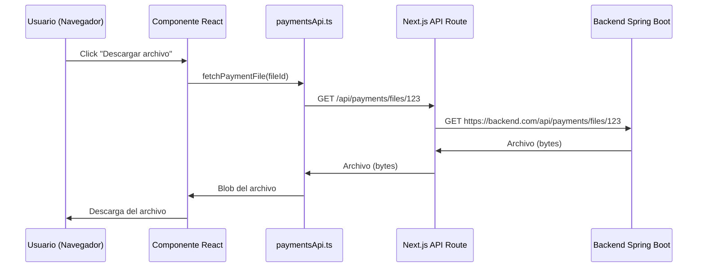

# Next.js 13+ App Router: API Routes vs Client-Side API Calls

## Índice
1. [Introducción](#introducción)
2. [App Router vs Pages Router](#app-router-vs-pages-router)
3. [Estructura de carpetas obligatoria](#estructura-de-carpetas-obligatoria)
4. [API Routes (route.ts)](#api-routes-routets)
5. [Client-Side API Calls (paymentsApi.ts)](#client-side-api-calls-paymentsapits)
6. [Diferencias clave](#diferencias-clave)
7. [Flujo completo de una petición](#flujo-completo-de-una-petición)
8. [Casos de uso](#casos-de-uso)
9. [Troubleshooting común](#troubleshooting-común)

## Introducción

Este documento explica las diferencias fundamentales entre **API Routes** (`route.ts`) y **Client-Side API Calls** (`paymentsApi.ts`) en Next.js 13+ con App Router, específicamente en el contexto de nuestro proyecto PersonalFit.

## App Router vs Pages Router

### Next.js 12 y anteriores (Pages Router)
```
pages/
├── api/
│   └── users.js        → endpoint /api/users
├── index.js            → página /
└── about.js            → página /about
```

### Next.js 13+ (App Router) - Nuestra versión actual
```
app/
├── api/
│   └── users/
│       └── route.ts    → endpoint /api/users
├── page.tsx            → página /
└── about/
    └── page.tsx        → página /about
```

## Estructura de carpetas obligatoria

### ❌ INCORRECTO (lo que teníamos antes)
```
Frontend/
├── api/                      ← Fuera de /app
│   └── payments/
│       └── files/
│           └── [id]/
│               └── route.ts  ← Next.js NO lo reconoce
└── app/
    ├── page.tsx
    └── payments/
```

### ✅ CORRECTO (estructura requerida)
```
Frontend/
├── api/                      ← Utilidades client-side
│   └── payments/
│       └── paymentsApi.ts    ← Funciones para llamar APIs
└── app/
    ├── page.tsx
    ├── payments/
    └── api/                  ← API endpoints del servidor
        └── payments/
            └── files/
                └── [id]/
                    └── route.ts ← Endpoint del servidor
```

## API Routes (route.ts)

### ¿Qué son?
- **Código que se ejecuta en el servidor** (backend de Next.js)
- **Endpoints HTTP** que responden a peticiones GET, POST, PUT, DELETE, etc.
- **Actúan como proxy** entre el frontend y el backend real

### Ubicación obligatoria
```
/app/api/[estructura]/route.ts
```

### Ejemplo: `/app/api/payments/files/[id]/route.ts`
```typescript
import { NextRequest, NextResponse } from 'next/server';

// Esto se ejecuta EN EL SERVIDOR de Next.js
export async function GET(
    request: NextRequest,
    { params }: { params: Promise<{ id: string }> }
) {
    const resolvedParams = await params;
    const fileId = resolvedParams.id;

    // Petición del servidor Next.js al backend Spring Boot
    const backendUrl = process.env.NEXT_PUBLIC_API_URL;
    const response = await fetch(`${backendUrl}/api/payments/files/${fileId}`);
    
    const fileBuffer = await response.arrayBuffer();
    
    return new NextResponse(fileBuffer, {
        status: 200,
        headers: { 'content-type': response.headers.get('content-type') || '' }
    });
}
```

### Características:
- **Se ejecuta en el servidor** de Next.js
- **Puede acceder a variables de entorno del servidor**
- **Puede hacer peticiones autenticadas** al backend
- **No es visible en el navegador** (el código no se envía al cliente)
- **Accesible vía HTTP** como cualquier API: `GET /api/payments/files/123`

## Client-Side API Calls (paymentsApi.ts)

### ¿Qué son?
- **Código que se ejecuta en el navegador** (frontend)
- **Funciones que hacen peticiones HTTP** desde el cliente
- **Utilidades para llamar APIs** (tanto internas como externas)

### Ubicación flexible
```
/api/[estructura]/[archivo].ts
/lib/api/[archivo].ts
/utils/api/[archivo].ts
```

### Ejemplo: `/api/payments/paymentsApi.ts`
```typescript
// Esto se ejecuta EN EL NAVEGADOR
export async function fetchPaymentFile(fileId: number): Promise<Blob> {
    // Petición del navegador al endpoint de Next.js
    const response = await fetch(`/api/payments/files/${fileId}`);
    
    if (!response.ok) {
        throw new Error('Failed to fetch file');
    }
    
    return await response.blob();
}

export async function createPayment(paymentData: PaymentData): Promise<PaymentResponse> {
    // Petición del navegador directamente al backend Spring Boot
    const response = await fetch(`${process.env.NEXT_PUBLIC_API_URL}/api/payments`, {
        method: 'POST',
        headers: {
            'Content-Type': 'application/json',
            'Authorization': `Bearer ${getToken()}`
        },
        body: JSON.stringify(paymentData)
    });
    
    return await response.json();
}
```

### Características:
- **Se ejecuta en el navegador**
- **Solo puede acceder a variables `NEXT_PUBLIC_*`**
- **Debe manejar autenticación manualmente** (tokens JWT)
- **El código es visible** en las DevTools del navegador
- **Son funciones de utilidad** para componentes React

## Diferencias clave

| Aspecto | API Routes (`route.ts`) | Client-Side API (`paymentsApi.ts`) |
|---------|-------------------------|-----------------------------------|
| **Ejecución** | Servidor Next.js | Navegador del usuario |
| **Propósito** | Crear endpoints HTTP | Funciones para llamar APIs |
| **Ubicación** | `/app/api/*/route.ts` | `/api/*/*.ts` (flexible) |
| **Variables de entorno** | Todas las variables | Solo `NEXT_PUBLIC_*` |
| **Autenticación** | Puede usar secrets del servidor | Debe usar tokens del cliente |
| **Visibilidad** | Código oculto | Código visible en DevTools |
| **Uso típico** | Proxy, autenticación, procesamiento | Llamadas desde componentes |

## Flujo completo de una petición

### Ejemplo: Descargar un archivo de pago



### Paso a paso:

1. **Usuario** hace click en "Descargar archivo"
2. **Componente React** llama a `fetchPaymentFile(123)` de `paymentsApi.ts`
3. **paymentsApi.ts** hace `fetch('/api/payments/files/123')` al endpoint de Next.js
4. **Next.js API Route** (`/app/api/payments/files/[id]/route.ts`) recibe la petición
5. **API Route** hace petición al backend Spring Boot con autenticación
6. **Backend** devuelve el archivo
7. **API Route** reenvía el archivo al frontend
8. **paymentsApi.ts** recibe el blob y lo devuelve al componente
9. **Componente** procesa el archivo para descarga

## Casos de uso

### Cuándo usar API Routes (`route.ts`)

1. **Proxy para el backend**
   ```typescript
   // /app/api/payments/files/[id]/route.ts
   export async function GET(request, { params }) {
       // Reenviar petición al backend con autenticación del servidor
   }
   ```

2. **Autenticación con secrets del servidor**
   ```typescript
   // /app/api/auth/login/route.ts
   export async function POST(request) {
       const secret = process.env.JWT_SECRET; // Solo disponible en servidor
   }
   ```

3. **Procesamiento de datos sensibles**
   ```typescript
   // /app/api/webhooks/mercadopago/route.ts
   export async function POST(request) {
       const webhookSecret = process.env.MERCADOPAGO_WEBHOOK_SECRET;
   }
   ```

### Cuándo usar Client-Side API (`paymentsApi.ts`)

1. **Llamadas directas al backend**
   ```typescript
   // /api/payments/paymentsApi.ts
   export async function fetchUserPayments(userId: number) {
       return fetch(`${BACKEND_URL}/api/payments/user/${userId}`);
   }
   ```

2. **Funciones reutilizables para componentes**
   ```typescript
   // /api/clients/usersApi.ts
   export async function searchUsers(query: string) {
       // Lógica para buscar usuarios
   }
   ```

3. **Manejo de autenticación client-side**
   ```typescript
   // /api/JWTAuth/api.ts
   export async function makeAuthenticatedRequest(url: string) {
       const token = localStorage.getItem('token');
       return fetch(url, {
           headers: { 'Authorization': `Bearer ${token}` }
       });
   }
   ```

## Troubleshooting común

### Error 404 en archivos de pago

**Problema:**
```
GET https://personalfitsantafe.com/api/payments/files/18 404 (Not Found)
```

**Causa:**
El archivo `route.ts` está en `/api/payments/files/[id]/` en lugar de `/app/api/payments/files/[id]/`

**Solución:**
```bash
# Mover de:
/api/payments/files/[id]/route.ts
# A:
/app/api/payments/files/[id]/route.ts
```

### Import errors en paymentsApi.ts

**Problema:**
```typescript
// ❌ Incorrecto
import { someFunction } from '/app/api/payments/files/[id]/route.ts'
```

**Causa:**
Intentar importar código de API Routes en client-side

**Solución:**
```typescript
// ✅ Correcto - usar fetch para llamar al endpoint
const response = await fetch('/api/payments/files/123');
```

### Variables de entorno no disponibles

**Problema:**
```typescript
// En paymentsApi.ts
const secret = process.env.JWT_SECRET; // undefined en el navegador
```

**Solución:**
```typescript
// ✅ En client-side solo variables NEXT_PUBLIC_*
const apiUrl = process.env.NEXT_PUBLIC_API_URL;

// ✅ En API Route todas las variables están disponibles
const secret = process.env.JWT_SECRET;
```

## Conclusión

La separación entre **API Routes** y **Client-Side API Calls** en Next.js 13+ es fundamental:

- **API Routes** (`/app/api/*/route.ts`) = **Endpoints del servidor**
- **Client-Side API** (`/api/*/*.ts`) = **Funciones para el navegador**

Esta arquitectura permite:
- **Seguridad**: Secrets del servidor no expuestos al cliente
- **Flexibilidad**: Proxy cuando necesario, llamadas directas cuando posible
- **Rendimiento**: Cacheo y optimizaciones del lado del servidor
- **Mantenimiento**: Separación clara de responsabilidades

### Regla de oro:
> Si creates un endpoint HTTP que responde a peticiones → **API Route** en `/app/api/`
> 
> Si creates funciones para hacer peticiones HTTP → **Client-Side API** en `/api/`
