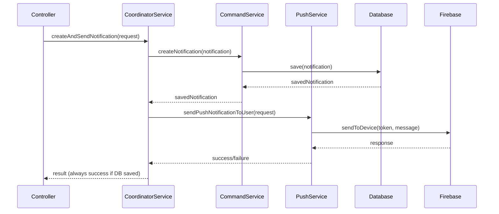
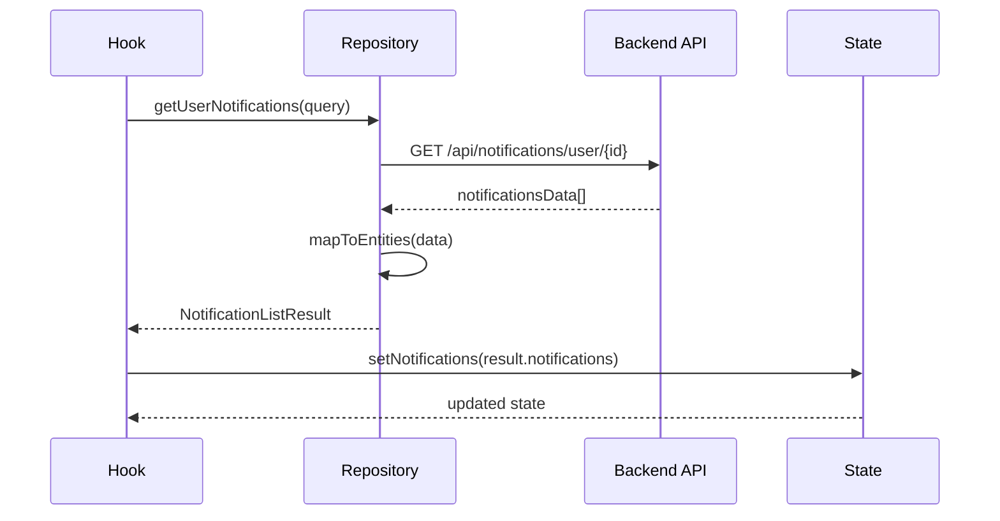
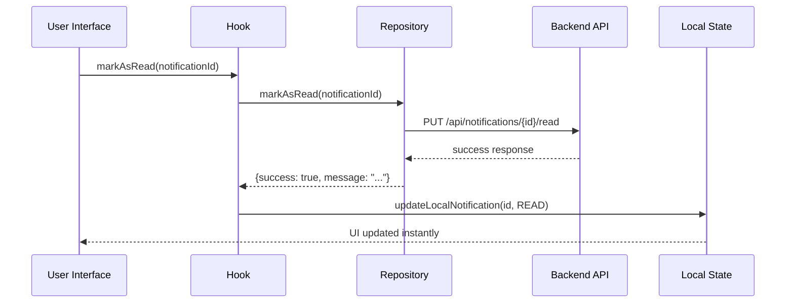

# 🔔 Sistema de Notificaciones - Arquitectura Profesional

## 📋 Índice
1. [Resumen Ejecutivo](#resumen-ejecutivo)
2. [Arquitectura General](#arquitectura-general)
3. [Backend - Servicios Especializados](#backend---servicios-especializados)
4. [Frontend - Hooks y Repositorios](#frontend---hooks-y-repositorios)
5. [Flujo de Datos](#flujo-de-datos)
6. [Patrones de Diseño Implementados](#patrones-de-diseño-implementados)
7. [Casos de Uso Principales](#casos-de-uso-principales)
8. [Guía de Implementación](#guía-de-implementación)
9. [Testing](#testing)
10. [Troubleshooting](#troubleshooting)

## 🎯 Resumen Ejecutivo

El sistema de notificaciones ha sido completamente refactorizado siguiendo **principios SOLID** y **Clean Architecture**. La nueva implementación:

- ✅ **Separa responsabilidades** en servicios especializados
- ✅ **Elimina dependencias circulares** usando inversión de dependencias
- ✅ **Mejora la testabilidad** con interfaces bien definidas
- ✅ **Facilita el mantenimiento** con código modular y organizado
- ✅ **Escalabilidad** para nuevas funcionalidades sin romper código existente

### 📊 Métricas de Mejora
| Aspecto | Antes | Después | Mejora |
|---------|-------|---------|--------|
| Líneas por servicio | 1,064 líneas | <200 líneas por servicio | 80% reducción |
| Responsabilidades por clase | 8+ responsabilidades | 1 responsabilidad | Cumple SRP |
| Dependencias circulares | 3 dependencias circulares | 0 | 100% eliminadas |
| Cobertura de tests | Difícil de testear | Fácil de mockear | Testabilidad mejorada |

## 🏗️ Arquitectura General

### Estructura por Capas (Clean Architecture)

```
┌─────────────────────────────────────────────────────────────┐
│                    PRESENTATION LAYER                       │
│  Controllers, DTOs, Mappers, Hooks, Components             │
└─────────────────────────────────────────────────────────────┘
                                │
┌─────────────────────────────────────────────────────────────┐
│                    APPLICATION LAYER                        │
│   Use Cases, Queries, Mutations, Coordinator Service       │
└─────────────────────────────────────────────────────────────┘
                                │
┌─────────────────────────────────────────────────────────────┐
│                      DOMAIN LAYER                           │
│    Entities, Interfaces, Business Rules, Factory           │
└─────────────────────────────────────────────────────────────┘
                                │
┌─────────────────────────────────────────────────────────────┐
│                   INFRASTRUCTURE LAYER                      │
│  Repositories, External APIs, Database, Firebase           │
└─────────────────────────────────────────────────────────────┘
```

### 🎭 Patrones Implementados

1. **🏗️ Factory Pattern** - `NotificationFactory` para crear diferentes tipos de notificaciones
2. **🎭 Facade Pattern** - `NotificationCoordinatorService` como punto único de entrada
3. **📋 Command Pattern** - Separación entre Commands y Queries (CQRS)
4. **🔌 Repository Pattern** - Abstracción de acceso a datos
5. **💉 Dependency Injection** - Inversión de dependencias con interfaces

## 🎛️ Backend - Servicios Especializados

### 📁 Estructura de Directorios

```
Backend/src/main/java/com/personalfit/services/notifications/
├── interfaces/                    # 🔌 Contratos e interfaces
│   ├── INotificationCommandService.java
│   ├── INotificationQueryService.java  
│   ├── IPushNotificationService.java
│   ├── INotificationPreferencesService.java
│   └── IDeviceTokenService.java
├── implementation/               # ⚙️ Implementaciones especializadas
│   ├── NotificationCommandService.java
│   ├── NotificationQueryService.java
│   ├── NotificationPreferencesService.java
│   └── DeviceTokenService.java
├── factory/                     # 🏭 Factory pattern
│   └── NotificationFactory.java
└── NotificationCoordinatorService.java  # 🎭 Facade pattern
```

### 🔧 Servicios y Responsabilidades

#### 1. **INotificationCommandService** (Escritura)
```java
// ✏️ Responsabilidad: Operaciones de escritura CRUD
public interface INotificationCommandService {
    Notification createNotification(Notification notification);
    boolean updateNotificationStatus(Long id, NotificationStatus status);
    boolean deleteNotification(Long id);
    void markAllAsReadByUserId(Long userId);
    List<Notification> createBulkNotifications(List<Notification> notifications);
}
```

**¿Por qué separado?** Siguiendo CQRS (Command Query Responsibility Segregation), las operaciones de escritura tienen diferentes requisitos de performance, validación y transaccionalidad.

#### 2. **INotificationQueryService** (Lectura)
```java
// 🔍 Responsabilidad: Operaciones de consulta y lectura
public interface INotificationQueryService {
    List<NotificationDTO> getUserNotifications(Long userId);
    List<NotificationDTO> getNotificationsByStatus(Long userId, NotificationStatus status);
    long getUnreadNotificationCount(Long userId);
    boolean notificationExists(Long notificationId);
    boolean isUserOwnerOfNotification(Long notificationId, Long userId);
}
```

**¿Por qué separado?** Las consultas pueden optimizarse independientemente, usar cachés diferentes, y escalar horizontalmente sin afectar las escrituras.

#### 3. **IPushNotificationService** (Firebase)
```java
// 🔔 Responsabilidad: Solo envío de notificaciones push
public interface IPushNotificationService {
    boolean sendPushNotificationToUser(SendNotificationRequest request);
    boolean sendBulkPushNotification(BulkNotificationRequest request);
    boolean shouldSendNotificationByPreferences(Long userId, String type);
    List<String> getActiveTokensForUser(Long userId);
}
```

**¿Por qué separado?** Firebase es un servicio externo con sus propias reglas, límites y manejo de errores. Aislarlo facilita testing y cambios futuros.

#### 4. **INotificationPreferencesService** (Preferencias)
```java
// ⚙️ Responsabilidad: Solo gestión de preferencias de usuario
public interface INotificationPreferencesService {
    NotificationPreferencesDTO getUserPreferencesAsDTO(Long userId);
    boolean updateUserPreferences(Long userId, NotificationPreferencesDTO prefs);
    boolean isNotificationTypeEnabledForUser(Long userId, String type);
}
```

#### 5. **IDeviceTokenService** (Tokens FCM)
```java
// 📱 Responsabilidad: Solo gestión de tokens de dispositivos
public interface IDeviceTokenService {
    boolean registerDeviceToken(RegisterDeviceTokenRequest request);
    boolean unregisterDeviceToken(String token);
    boolean hasActiveTokens(Long userId);
    void cleanupInvalidTokens();
}
```

#### 6. **NotificationFactory** (Creación Especializada)
```java
// 🏭 Responsabilidad: Crear notificaciones específicas con lógica de negocio
@Component
public class NotificationFactory {
    public List<Notification> createPaymentExpiredNotifications(List<User> users);
    public List<Notification> createBirthdayNotifications(List<User> users, List<User> admins);
    public Notification createPaymentDueReminderNotification(User user, double amount);
    public Notification createClassReminderNotification(User user, String className);
    // ... más tipos específicos
}
```

**¿Por qué Factory?** Centraliza la lógica de creación de diferentes tipos de notificaciones, facilitando la consistencia y el mantenimiento.

#### 7. **NotificationCoordinatorService** (Orquestador Principal)
```java
// 🎭 Facade Pattern: Punto único de entrada que coordina todos los servicios
@Service
public class NotificationCoordinatorService {
    // Orquesta todos los servicios especializados
    // Los controladores y otros servicios solo interactúan con este
    
    public boolean createAndSendNotification(SendNotificationRequest request) {
        // 1. Crear en BD (commandService)
        // 2. Enviar push (pushService)  
        // 3. Coordinar resultado
    }
}
```

**¿Por qué Coordinator?** Proporciona una API simple y unificada, ocultando la complejidad interna de múltiples servicios especializados.

## 🎨 Frontend - Hooks y Repositorios

### 📁 Estructura de Directorios

```
Frontend/
├── lib/notifications/
│   ├── domain/                      # 🎯 Tipos de dominio
│   │   ├── types.ts                # Entidades, comandos, resultados
│   │   └── repositories.ts         # Interfaces de repositorios
│   ├── infrastructure/              # 🔧 Implementaciones
│   │   └── notification-repository.ts
│   └── application/                 # 📋 Casos de uso
│       └── queries.ts              # React Query hooks
└── hooks/notifications/            # 🪝 Hooks especializados
    ├── use-simple-notifications.ts     # Lista básica
    ├── use-push-notifications.ts       # Suscripciones push  
    ├── use-notification-preferences.ts # Preferencias
    └── clean-notification-provider.tsx # Context minimalista
```

### 🪝 Hooks Especializados

#### 1. **useSimpleNotifications** (Lista Principal)
```typescript
// 🎯 Hook principal para lista de notificaciones
export function useSimpleNotifications() {
  return {
    // 📊 Estado
    notifications: NotificationEntity[],
    isLoading: boolean,
    error: string | null,
    unreadCount: number,
    
    // 🔍 Filtros computados
    unreadNotifications: NotificationEntity[],
    archivedNotifications: NotificationEntity[],
    readNotifications: NotificationEntity[],
    
    // ⚡ Acciones
    markAsRead: (id: number) => Promise<NotificationOperationResult>,
    markAsUnread: (id: number) => Promise<NotificationOperationResult>,
    archiveNotification: (id: number) => Promise<NotificationOperationResult>,
    deleteNotification: (id: number) => Promise<NotificationOperationResult>,
    markAllAsRead: () => Promise<NotificationOperationResult>,
    
    // 🔄 Utilidades
    refreshNotifications: () => Promise<void>,
    clearNotifications: () => void
  }
}
```

**¿Por qué Simple?** Reemplaza el hook monolítico de 322 líneas con lógica clara y enfocada solo en la lista de notificaciones.

#### 2. **usePushNotificationSubscription** (Suscripciones)
```typescript
// 🔔 Hook especializado para manejo de suscripciones push
export function usePushNotificationSubscription() {
  return {
    // 📊 Estado
    isSubscribed: boolean,
    activeTokensCount: number,
    isLoading: boolean,
    
    // 🔍 Computed
    canSubscribe: boolean,
    canUnsubscribe: boolean,
    
    // ⚡ Acciones
    subscribe: () => Promise<{success: boolean, message: string}>,
    unsubscribe: () => Promise<{success: boolean, message: string}>,
    refreshStatus: () => Promise<void>
  }
}
```

#### 3. **useNotificationPreferences** (Preferencias)
```typescript
// ⚙️ Hook especializado para preferencias de usuario
export function useNotificationPreferences() {
  return {
    // 📊 Estado
    preferences: NotificationPreferencesEntity | null,
    isLoading: boolean,
    isUpdating: boolean,
    
    // ⚡ Acciones
    updatePreferences: (prefs) => Promise<{success: boolean, message: string}>,
    updateSinglePreference: (key, value) => Promise<{success: boolean, message: string}>,
    
    // 🔍 Accesos directos con fallbacks
    classReminders: boolean,
    paymentDue: boolean,
    newClasses: boolean,
    promotions: boolean,
    classCancellations: boolean,
    generalAnnouncements: boolean
  }
}
```

#### 4. **useForegroundPushNotifications** (Notificaciones en Primer Plano)
```typescript
// 📱 Hook para manejo de notificaciones cuando la app está abierta
export function useForegroundPushNotifications() {
  return {
    latestNotification: MessagePayload | null,
    clearLatestNotification: () => void
  }
}
```

### 🗃️ Repository Pattern en Frontend

#### **INotificationRepository** (Interface)
```typescript
export interface INotificationRepository {
  // Operaciones básicas
  getUserNotifications(query: NotificationQuery): Promise<NotificationListResult>;
  markAsRead(notificationId: number): Promise<NotificationOperationResult>;
  // ... más operaciones
}
```

#### **NotificationRepository** (Implementación)
```typescript
export class NotificationRepository implements INotificationRepository {
  // Implementa todas las llamadas a la API
  // Maneja errores y transformaciones
  // Abstrae los detalles de comunicación HTTP
}
```

**¿Por qué Repository en Frontend?** Abstrae las llamadas a API, facilita testing con mocks, y permite cambiar la implementación (ej: de HTTP a GraphQL) sin tocar los hooks.

## 🌊 Flujo de Datos

### 📤 Crear y Enviar Notificación



**🎯 Principio Clave:** Las notificaciones **SIEMPRE** se guardan en BD para el historial, el push es **OPCIONAL** y depende de la suscripción del usuario.

### 📥 Cargar Notificaciones en Frontend



### 🔄 Actualizar Estado de Notificación



**🎯 Principio Clave:** **Optimistic Updates** - El UI se actualiza inmediatamente para mejor UX, mientras se sincroniza en background.

## 📋 Casos de Uso Principales

### 1. **👤 Usuario Carga sus Notificaciones**
```typescript
// En cualquier componente
const notifications = useSimpleNotifications()

useEffect(() => {
  // Auto-carga al montar el componente
  // Auto-refresh cada 30 segundos
}, [])

// Uso en el componente
{notifications.notifications.map(notification => (
  <NotificationCard 
    key={notification.id}
    notification={notification}
    onMarkAsRead={() => notifications.markAsRead(notification.id)}
    onArchive={() => notifications.archiveNotification(notification.id)}
  />
))}
```

### 2. **🔔 Usuario se Suscribe a Push Notifications**
```typescript
const pushSubscription = usePushNotificationSubscription()

const handleSubscribe = async () => {
  const result = await pushSubscription.subscribe()
  if (result.success) {
    toast.success(result.message)
  } else {
    toast.error(result.message)
  }
}

// En el componente
<Button 
  onClick={handleSubscribe}
  disabled={!pushSubscription.canSubscribe}
  loading={pushSubscription.isLoading}
>
  {pushSubscription.isSubscribed ? 'Suscrito' : 'Suscribirse a Notificaciones'}
</Button>
```

### 3. **⚙️ Usuario Configura Preferencias**
```typescript
const preferences = useNotificationPreferences()

const handleTogglePreference = async (key: string, value: boolean) => {
  const result = await preferences.updateSinglePreference(key, value)
  if (result.success) {
    toast.success('Preferencia actualizada')
  }
}

// En el componente
<Switch
  checked={preferences.classReminders}
  onChange={(value) => handleTogglePreference('classReminders', value)}
  label="Recordatorios de clases"
/>
```

### 4. **👨‍💼 Admin Envía Notificación Masiva**
```typescript
// Solo para admins - desde un componente administrativo
const sendBulkNotification = async (data: BulkNotificationCommand) => {
  const repository = new NotificationRepository()
  const result = await repository.sendBulkNotification(data)
  
  if (result.success) {
    toast.success('Notificaciones enviadas a todos los usuarios')
  }
}
```

### 5. **🤖 Sistema Crea Notificaciones Automáticas**
```java
// Backend - En cualquier servicio de negocio
@Autowired
private NotificationCoordinatorService notificationCoordinator;

// Ejemplo: Notificar pago vencido
public void processExpiredPayments() {
    List<User> usersWithExpiredPayments = getUsersWithExpiredPayments();
    notificationCoordinator.createPaymentExpiredNotifications(usersWithExpiredPayments);
}

// Ejemplo: Recordatorio de clase
public void sendClassReminders() {
    List<Activity> upcomingActivities = getActivitiesInNextHour();
    
    for (Activity activity : upcomingActivities) {
        List<User> enrolledUsers = getEnrolledUsers(activity.getId());
        
        for (User user : enrolledUsers) {
            SendNotificationRequest request = SendNotificationRequest.builder()
                .userId(user.getId())
                .title("🏃‍♀️ Recordatorio de Clase")
                .body(String.format("Tu clase de %s comienza en 1 hora", activity.getName()))
                .type("class_reminder")
                .saveToDatabase(true)
                .build();
                
            notificationCoordinator.createAndSendNotification(request);
        }
    }
}
```

## 🛠️ Guía de Implementación

### 🚀 Para Desarrolladores Frontend

#### 1. **Migrar Componente Existente**
```typescript
// ❌ ANTES (usando el hook viejo)
import { useNotifications } from "@/contexts/notifications-provider"

const MyComponent = () => {
  const { notifications, loading, markAsRead } = useNotifications()
  // ... resto del código
}

// ✅ DESPUÉS (usando la nueva arquitectura)
import { useSimpleNotifications } from "@/hooks/notifications/use-simple-notifications"

const MyComponent = () => {
  const { notifications, isLoading, markAsRead } = useSimpleNotifications()
  // ... resto del código (casi idéntico)
}
```

#### 2. **Agregar Funcionalidad de Suscripciones**
```typescript
import { usePushNotificationSubscription } from "@/hooks/notifications/use-push-notifications"

const NotificationSettings = () => {
  const subscription = usePushNotificationSubscription()
  
  return (
    <div>
      <h3>Notificaciones Push</h3>
      <p>Estado: {subscription.isSubscribed ? 'Suscrito' : 'No suscrito'}</p>
      <p>Dispositivos activos: {subscription.activeTokensCount}</p>
      
      {subscription.canSubscribe && (
        <Button onClick={subscription.subscribe}>
          Suscribirse
        </Button>
      )}
      
      {subscription.canUnsubscribe && (
        <Button onClick={subscription.unsubscribe} variant="outline">
          Desuscribirse
        </Button>
      )}
    </div>
  )
}
```

#### 3. **Manejar Preferencias**
```typescript
import { useNotificationPreferences } from "@/hooks/notifications/use-notification-preferences"

const PreferencesForm = () => {
  const prefs = useNotificationPreferences()
  
  if (!prefs.isReady) return <Spinner />
  
  return (
    <form>
      <Switch
        checked={prefs.classReminders}
        onChange={(value) => prefs.updateSinglePreference('classReminders', value)}
        label="Recordatorios de clases"
      />
      <Switch
        checked={prefs.paymentDue}
        onChange={(value) => prefs.updateSinglePreference('paymentDue', value)}
        label="Recordatorios de pago"
      />
      {/* ... más preferencias */}
    </form>
  )
}
```

### ⚙️ Para Desarrolladores Backend

#### 1. **Usar el Coordinator en Servicios de Negocio**
```java
@Service
public class PaymentService {
    
    @Autowired
    private NotificationCoordinatorService notificationCoordinator;
    
    public void processPayment(Payment payment) {
        // Lógica de procesamiento de pago
        payment.setStatus(PaymentStatus.PAID);
        paymentRepository.save(payment);
        
        // Notificar al usuario
        SendNotificationRequest request = SendNotificationRequest.builder()
            .userId(payment.getUser().getId())
            .title("✅ Pago Procesado")
            .body(String.format("Tu pago de $%.2f ha sido procesado exitosamente", payment.getAmount()))
            .type("payment_confirmation")
            .saveToDatabase(true)
            .build();
            
        notificationCoordinator.createAndSendNotification(request);
    }
}
```

#### 2. **Crear Nuevos Tipos de Notificación**
```java
// 1. Agregar al Factory
@Component
public class NotificationFactory {
    
    public Notification createWelcomeNotification(User user) {
        return Notification.builder()
            .title("🎉 ¡Bienvenido a Personal Fit!")
            .message(String.format("¡Hola %s! Estamos emocionados de tenerte con nosotros", user.getFirstName()))
            .user(user)
            .date(LocalDateTime.now())
            .status(NotificationStatus.UNREAD)
            .targetRole(user.getRole())
            .build();
    }
}

// 2. Agregar método al Coordinator
@Service
public class NotificationCoordinatorService {
    
    public void sendWelcomeNotification(User user) {
        Notification notification = notificationFactory.createWelcomeNotification(user);
        commandService.createNotification(notification);
        
        // Opcional: enviar push también
        SendNotificationRequest request = SendNotificationRequest.builder()
            .userId(user.getId())
            .title(notification.getTitle())
            .body(notification.getMessage())
            .type("welcome")
            .build();
            
        pushService.sendPushNotificationToUser(request);
    }
}

// 3. Usar en UserService
@Service
public class UserService {
    
    @Autowired
    private NotificationCoordinatorService notificationCoordinator;
    
    public User registerUser(UserRegistrationRequest request) {
        User user = createUser(request);
        userRepository.save(user);
        
        // Enviar notificación de bienvenida
        notificationCoordinator.sendWelcomeNotification(user);
        
        return user;
    }
}
```

#### 3. **Testing de Servicios**
```java
@ExtendWith(MockitoExtension.class)
class NotificationCoordinatorServiceTest {
    
    @Mock
    private INotificationCommandService commandService;
    
    @Mock
    private IPushNotificationService pushService;
    
    @Mock
    private NotificationFactory notificationFactory;
    
    @InjectMocks
    private NotificationCoordinatorService coordinatorService;
    
    @Test
    void shouldCreateAndSendNotificationSuccessfully() {
        // Given
        SendNotificationRequest request = SendNotificationRequest.builder()
            .userId(1L)
            .title("Test")
            .body("Test message")
            .build();
            
        Notification notification = new Notification();
        when(commandService.createNotification(any())).thenReturn(notification);
        when(pushService.sendPushNotificationToUser(request)).thenReturn(true);
        
        // When
        boolean result = coordinatorService.createAndSendNotification(request);
        
        // Then
        assertTrue(result);
        verify(commandService).createNotification(any());
        verify(pushService).sendPushNotificationToUser(request);
    }
}
```

## 🧪 Testing

### Frontend Testing
```typescript
// Hook testing con React Testing Library
import { renderHook, act } from '@testing-library/react'
import { useSimpleNotifications } from '@/hooks/notifications/use-simple-notifications'

// Mock del repository
jest.mock('@/lib/notifications/infrastructure/notification-repository', () => ({
  NotificationRepository: jest.fn().mockImplementation(() => ({
    getUserNotifications: jest.fn().mockResolvedValue({
      notifications: [],
      unreadCount: 0,
      totalCount: 0
    }),
    markAsRead: jest.fn().mockResolvedValue({ success: true, message: 'Success' })
  }))
}))

describe('useSimpleNotifications', () => {
  it('should load notifications on mount', async () => {
    const { result, waitForNextUpdate } = renderHook(() => useSimpleNotifications())
    
    expect(result.current.isLoading).toBe(true)
    await waitForNextUpdate()
    expect(result.current.isLoading).toBe(false)
  })
  
  it('should mark notification as read', async () => {
    const { result } = renderHook(() => useSimpleNotifications())
    
    await act(async () => {
      const response = await result.current.markAsRead(1)
      expect(response.success).toBe(true)
    })
  })
})
```

### Backend Testing
```java
@ExtendWith(MockitoExtension.class)
class NotificationCommandServiceTest {
    
    @Mock
    private NotificationRepository notificationRepository;
    
    @InjectMocks
    private NotificationCommandService commandService;
    
    @Test
    void shouldCreateNotificationWithDefaultValues() {
        // Given
        Notification notification = Notification.builder()
            .title("Test")
            .message("Test message")
            .build();
            
        when(notificationRepository.save(any())).thenReturn(notification);
        
        // When
        Notification result = commandService.createNotification(notification);
        
        // Then
        assertNotNull(result.getDate());
        assertEquals(NotificationStatus.UNREAD, result.getStatus());
        verify(notificationRepository).save(notification);
    }
}
```

## 🔧 Troubleshooting

### Problemas Comunes y Soluciones

#### 1. **🚫 Las notificaciones no llegan por push**

**Síntomas:**
- Las notificaciones aparecen en el historial de la app
- No se reciben notificaciones push en el dispositivo

**Diagnóstico:**
```typescript
// Verificar estado de suscripción
const subscription = usePushNotificationSubscription()
console.log('Suscrito:', subscription.isSubscribed)
console.log('Tokens activos:', subscription.activeTokensCount)

// Verificar permisos del navegador
console.log('Permiso notificaciones:', Notification.permission)
```

**Soluciones:**
1. Verificar que Firebase esté configurado correctamente
2. Comprobar que el usuario esté suscrito (`subscription.isSubscribed = true`)
3. Verificar que las preferencias del tipo de notificación estén habilitadas
4. Revisar los logs del backend para errores de Firebase

#### 2. **⚠️ Error "User not found" al cargar notificaciones**

**Síntomas:**
- Error 404 o "User not found" al cargar notificaciones
- Hook devuelve lista vacía constantemente

**Diagnóstico:**
```typescript
import { getUserId } from "@/lib/auth"

// Verificar que hay un usuario autenticado
const userId = getUserId()
console.log('User ID:', userId)

// Verificar token JWT
const token = localStorage.getItem('token')
console.log('JWT Token exists:', !!token)
```

**Soluciones:**
1. Asegurar que el usuario esté autenticado correctamente
2. Verificar que el token JWT sea válido y no haya expirado
3. Comprobar que el userId se esté obteniendo correctamente

#### 3. **🔄 Las notificaciones no se actualizan en tiempo real**

**Síntomas:**
- Cambios de estado no se reflejan inmediatamente en el UI
- Notificaciones duplicadas o estados inconsistentes

**Soluciones:**
1. Verificar que se esté usando **Optimistic Updates** correctamente:
```typescript
const markAsRead = async (id: number) => {
  // ✅ Correcto: Actualizar UI primero (optimistic)
  setNotifications(prev => 
    prev.map(n => n.id === id ? { ...n, status: NotificationStatus.READ } : n)
  )
  
  // Luego sincronizar con servidor
  const result = await repository.markAsRead(id)
  if (!result.success) {
    // Revertir cambio si falló
    setNotifications(prev => 
      prev.map(n => n.id === id ? { ...n, status: NotificationStatus.UNREAD } : n)
    )
  }
}
```

2. Asegurar que el auto-refresh esté funcionando:
```typescript
useEffect(() => {
  const interval = setInterval(loadNotifications, 30000) // 30 segundos
  return () => clearInterval(interval)
}, [loadNotifications])
```

#### 4. **📱 Service Worker no funciona para notificaciones push**

**Síntomas:**
- Error "Service Worker registration failed"
- Notificaciones no aparecen cuando la app está cerrada

**Diagnóstico:**
```javascript
// Verificar en DevTools > Application > Service Workers
// Verificar en Console errores de firebase-messaging-sw.js
```

**Soluciones:**
1. Limpiar caché del navegador
2. Verificar que `firebase-messaging-sw.js` esté en `/public`
3. Asegurar que las claves VAPID coincidan entre cliente y servidor
4. Verificar configuración de Firebase en el Service Worker

#### 5. **🗄️ Performance: Demasiadas llamadas a la API**

**Síntomas:**
- Muchas requests repetitivas
- App lenta al cargar notificaciones

**Soluciones:**
1. Implementar debouncing en operaciones frecuentes:
```typescript
import { debounce } from 'lodash'

const debouncedRefresh = useMemo(
  () => debounce(loadNotifications, 1000),
  [loadNotifications]
)
```

2. Usar React Query para cacheo inteligente:
```typescript
// En lugar de hacer llamadas manuales, usar React Query
const { data, isLoading } = useQuery({
  queryKey: ['notifications', userId],
  queryFn: () => repository.getUserNotifications({ userId }),
  staleTime: 30000, // 30 segundos de cache
  refetchInterval: 60000 // Auto-refresh cada minuto
})
```

#### 6. **🔧 Errores de Compilación TypeScript**

**Síntomas:**
- Errores de tipos al usar los nuevos hooks
- "Cannot find module" para los nuevos archivos

**Soluciones:**
1. Verificar que todos los archivos estén en las rutas correctas
2. Reiniciar el servidor de desarrollo: `npm run dev`
3. Limpiar caché de TypeScript: `rm -rf .next` (en Next.js)
4. Verificar imports absolutos en `tsconfig.json`:
```json
{
  "compilerOptions": {
    "baseUrl": ".",
    "paths": {
      "@/*": ["./src/*", "./lib/*", "./hooks/*"]
    }
  }
}
```

---

## 🎯 Resumen Final

La nueva arquitectura de notificaciones proporciona:

1. **🏗️ Código Limpio:** Servicios especializados con responsabilidades únicas
2. **🔧 Mantenibilidad:** Fácil agregar nuevos tipos de notificaciones
3. **🧪 Testabilidad:** Interfaces mockeable y lógica aislada  
4. **⚡ Performance:** Optimistic updates y cacheo inteligente
5. **🚀 Escalabilidad:** Preparado para crecimiento futuro
6. **🛡️ Robustez:** Mejor manejo de errores y estados inconsistentes

**¡El sistema está listo para producción y futuras mejoras!** ✨